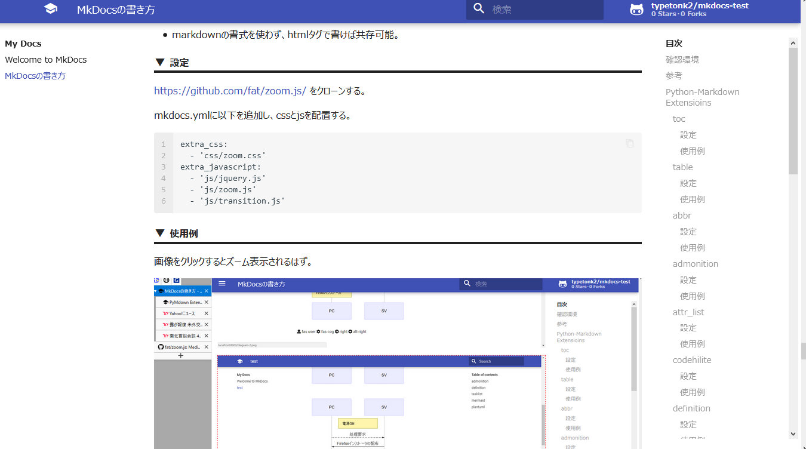

# MkDocsの書き方

MkDocsの書き方やextensionについて試した結果のメモ。
実際に試した構文や拡張機能と、その結果。

## 確認環境

```
python             3.6.4
markdown-include   0.5.1
markdown-lightbox  0.0.0
mkdocs             1.0.4
mkdocs-material    4.0.1
pymdown-extensions 6.0
plantuml-markdown  2.0.1
```

* mkdocs-materialテーマでのみ確認。
* このテーマは fonts.googleapis.com からcss等を取得するため、オフライン環境だと一部おかしくなる。

## 参考

基本的な構文  
https://daringfireball.net/projects/markdown/syntax

python-markdownが標準でサポートしている拡張機能  
https://python-markdown.github.io/extensions/

pymdown-extensionsで使える拡張機能  
https://facelessuser.github.io/pymdown-extensions/

mkdocs-material  
https://squidfunk.github.io/mkdocs-material/

## Python-Markdown Extensioins 

Python-Markdownに標準で含まれている拡張機能。

### toc

目次を付ける。

#### 設定

```
markdown_extensions:
  - toc:
      permalink: true # permalinkを作成
      separator: "_"  # リンクの区切り文字を設定
      marker: "[TOC]" # 目次に置き換える文字列
      title: "=== 目次 ===" # 目次のタイトル
```

#### 使用例


??? 目次

    [TOC]

### table

表を書く。

#### 設定

```
markdown_extensions:
  - tables
```

#### 使用例

```
| name                 | ver      | info                   |
| -------------------- | -------- | ---                    |
| mkdocs               | 0.17.3   | mkdocsの機能           |
| mkdocs-material      | 2.7.1    | mkdocsのテーマ         |
| pymdown-extensions   | 4.9.1    | markdownの拡張機能     |
```

| name                 | ver      | info                   |
| -------------------- | -------- | ---                    |
| mkdocs               | 0.17.3   | mkdocsの機能           |
| mkdocs-material      | 2.7.1    | mkdocsのテーマ         |
| pymdown-extensions   | 4.9.1    | markdownの拡張機能     |

* 左寄せと右寄せ。
* 最初と最後の`|`は省略可能。

```
 name                 | ver       | info
:-------------------- | --------: | :---:
mkdocs                | 0.17.3    | mkdocsの機能           |
mkdocs-material       | 2.7.1     | mkdocsのテーマ         |
pymdown-extensions    | 4.9.1     | markdownの拡張機能     |
```

 name                 | ver       | info
:-------------------- | --------: | :---:
mkdocs                | 0.17.3    | mkdocsの機能           |
mkdocs-material       | 2.7.1     | mkdocsのテーマ         |
pymdown-extensions    | 4.9.1     | markdownの拡張機能     |

テーブル内でitalic等。

```
hoge   | foo            | bar
-      | -              | -
strong | **strong**     | bar**strong**
italic | *italic*       | bar*italic*
num    | 4020000**400** | **400**
```

hoge   | foo            | bar
-      | -              | -
strong | **strong**     | bar**strong**
italic | *italic*       | bar*italic*
num    | 4020000**400** | **400**

### abbr

略語の追加。

#### 設定

```
markdown_extensions:
  - abbr
```

#### 使用例

[公式](https://python-markdown.github.io/extensions/abbreviations/)から。

```
The HTML specification
is maintained by the W3C.

*[HTML]: Hyper Text Markup Language
*[W3C]:  World Wide Web Consortium
```

The HTML specification
is maintained by the W3C.

*[HTML]: Hyper Text Markup Language
*[W3C]:  World Wide Web Consortium

* 前後をスペースで区切る必要あり。
* 略語の指定はどこに書いてもよい。

### admonition

注意/警告 等の通知メッセージ。  

#### 設定

```
markdown_extensions:
  - admonition
```

#### 使用例

!!! Note
    ```md
    !!! Note
        This is Note!
    ```

!!! Warning
    ```md
    !!! Warning
        This is Warning!
    ```

!!! Danger
    ```md
    !!! Danger
        This is Danger!
    ```

!!! Success
    ```md
    !!! Success
        This is Success!
    ```

!!! Error
    ```md
    !!! Error
        This is Error!
    ```

!!! Failure
    ```
    !!! Failure
        This is Failure!
    ```

!!! Bug
    ```md
    !!! Bug
        This is Bug!
    ```

!!! Summary
    ```md
    !!! Summary
        This is Summary!
    ```

!!! Info
    ```md
    !!! Tip
        This is Info!
    ```

!!! Todo
    ```md
    !!! Todo
        This is Todo!
    ```

* タイトルを変更

!!! Note "Change title"
    ```
    !!! Note "Change title"
        This is Note!
    ```

### attr_list

要素に属性を付与出来る。  

#### 設定

```
markdown_extensions:
  - attr_list
```

#### 使用例

```
add attribute
{: #a_id .a_class }
```

add attribute
{: #a_id .a_class }

```
[_blank link](http://www.mkdocs.org/){: target="_blank" }
[_self link](http://www.mkdocs.org/){: target="_self" }
```

[_blank link](http://www.mkdocs.org/){: target="_blank" }

[_self link](http://www.mkdocs.org/){: target="_self" }

### codehilite

コードブロックを色付けする。

#### 設定

```
markdown_extensions:
  - codehilite
      linenums: true # 行番号を付与
      use_pygments: true # Pygmentsを使用
```

#### 使用例

html

```
  ```html
  <i class="test">foobar</i>
  ```
```

```html
<i class="test">foobar</i>
```

python + 任意行のハイライト

```
  ```python hl_lines="3 5"
  from datetime import datetime

  now = datetime.now()
  mm = str(now.month)
  dd = str(now.day)
  yyyy = str(now.year)
  hour = str(now.hour)
  mi = str(now.minute)
  ss = str(now.second)

  print mm + "/" + dd + "/" + yyyy + " " + hour + ":" + mi + ":" + ss
  ```
```

```python hl_lines="3 5"
from datetime import datetime

now = datetime.now()
mm = str(now.month)
dd = str(now.day)
yyyy = str(now.year)
hour = str(now.hour)
mi = str(now.minute)
ss = str(now.second)

print mm + "/" + dd + "/" + yyyy + " " + hour + ":" + mi + ":" + ss
```


### definition

定義リスト。使い道無さそう。

#### 設定

```
markdown_extensions:
  - def_list
```

#### 使用例

```
質問1
: 回答1
```

質問
: 回答

### footnotes

#### 設定

```
markdown_extensions:
  - footnotes
```

#### 使用例

```
MkDocsで脚注[^1]を付ける。

[^1]: ページの一番下に表示されるはず。
```

MkDocsで脚注[^1]を付ける。

[^1]: ページの一番下に表示されるはず。

### nl2br

New Line To BReak の略。末尾にスペースを2つ入れなくても改行されるようにする。
GFM もこれらしい。

*[GFM]: GitHub Flavored Markdown

#### 設定

```
markdown_extensions:
  - nl2br
```

#### 使用例

```
末尾にスペースを2つ
入れていなくても改行される。
```

末尾にスペースを2つ
入れていなくても改行される。

もちろん入れていても問題はない。

### wikilinks

wikiのようなリンクを作成する。

* `[[index.md]]`とすると、リンクが作成されなかった。
* `[[path/to/name]]`のような階層指定も出来ない。微妙。

#### 設定

```
markdown_extensions:
  - wikilinks
```

#### 使用例

```
[[MkDocsの書き方]] へのリンク。
```

[[MkDocsの書き方]] へのリンク。

## Pymdown Extensions

追加拡張機能が色々含まれているパッケージ。  
別途pip等でインストールして使用する必要がある。

* mkdocs-materialを導入すれば、一部は一緒にインストールされる。

### details

admonitionを折り畳める。

#### 設定

```
markdown_extensions:
  - pymdownx.details
```

#### 使用例

```
???+ Note
    折り畳めるノート。展開済み。

    ??? Summary
        折り畳まれたサマリー
```

???+ note
    折り畳めるnote。

    ??? danger
        折り畳まれたdanger


### tasklist

GitHubっぽいタスクリスト。オプションを有効にすると外部からcssを取得する模様。

#### 設定

```
markdown_extensions:
  - pymdownx.tasklist:
      custom_checkbox: true
      clickable_checkbox: true
```

#### 使用例

* [x] task1
* [ ] task2

### magiclink

`http[s]://~`なテキストを、自動的にリンクにする。

#### 設定

```
markdown_extensions:
  - pymdownx.magiclink
```

#### 使用例

https://daringfireball.net/projects/markdown/syntax

http://www.mkdocs.org/

www.mkdocs.org

mkdocs.org

### mark

文字列をハイライト表示する。

#### 設定

```
markdown_extensions:
  - pymdownx.mark
```

#### 使用例

```
これは通常の文字列。  
これは==ハイライトされた文字列==
```

これは通常の文字列です。  
これは ==ハイライトされた文字列== です。

### keys

ctrlやaltをそれっぽく表示する。

#### 設定

```
markdown_extensions:
  - pymdownx.keys
```

#### 使用例

```
+++ctrl+alt+delete+++
```

++ctrl+alt+delete++

### Snippets

外部ファイルを読み込む。rstやasciidocのinclude構文のようなもの。

#### 設定

```
markdown_extensions:
  - pymdownx.snippets:
      base_path: docs
```

* base_pathを指定しない場合、mkdocs.ymlがある場所になる。

#### 使用例

コードブロックで囲っても、読み込まれた内容が表示される。
また、syntaxもおかしくなるため、
[Snippets - PyMdown Extensions Documentation](https://facelessuser.github.io/pymdown-extensions/extensions/snippets/)
を参照。

後述の`markdown_include`の方がいいかもしれない。

### SuperFences

幾つか機能があるけど、使いたいものだけに絞る。

* Nested Fences
* Tabbed Fences

#### 設定

```
markdown_extensions:
  - pymdownx.superfences
```

#### 使用例

```md tab="nested list"
* 
    ```py3 
    import sys;
    print(sys.version)
    ```
* b
* c
```

```bat tab=
@ECHO OFF
ECHO %USERPROFILE%
```

```html tab=
<div class="hoge">
    
</div>
```

```md tab=
## tabbed

[tabbed](#link) markdown.
```

!!! example
    ````tab="Source"
    ```py3
    import foo.bar
    ```
    ````

    ```py3 tab="Output"
    import foo.bar
    ```

## その他

markdown標準やpymdownxに含まれていないもの。  
GitHub等から直接インストールしたり、外部jsとして追加して使用する。

### markdown_include

Snippetsと同じく、外部ファイルを読み込む。

#### 設定

pipでインストール。

`pip install markdown-include`

mkdocs.ymlで設定。

```
markdown_extensions:
  - markdown_include.include:
      base_path: docs
```

* base_pathを指定しない場合、mkdocs.ymlがある場所になる。

#### 使用例

コードブロックで囲った場合。

```
{!include.txt!}
```

囲わなかった場合。

{!include.txt!}

### Lightbox

画像をクリックする事で拡大表示する。
http://lokeshdhakar.com/projects/lightbox2/

* zoom.jsとは併用できない。
* extensionを読み込まず、直接htmlで記述すれば可能。

#### 設定

https://github.com/AliciaSchep/markdown-lightbox をクローンする。

展開し、`pip install <展開したフォルダ>`でインストール。

mkdocs.ymlに以下を追加し、cssとjsを配置する。

```
extra_css:
  - 'css/lightbox.css'
extra_javascript:
  - 'js/lightbox-plus-jquery.js'
markdown_extensions:
  - lightbox
```

#### 使用例

画像をクリックするとオーバーレイ表示されるはず。
…なんだけど、後述のzoom.jsと色々試していたら、`TypeError: this.$overlay is undefined`で動かなくなった。
jquery.jsとか入れたり消したりしてたから、おかしくなってるのかなぁ。

現在はzoom.jsを有効にしているため、以下はhtmlで記述している。どのみち上記のエラーで動かないけど。

<a data-lightbox="all_images" data-title="lightbox test" href="../sample.png">
  
</a>


### zoom.js

画像をズーム表示する。

#### 設定

https://github.com/fat/zoom.js/ をクローンする。

http://www.transitionjs.org/ をダウンロードする。

https://jquery.com/ をダウンロードする。

mkdocs.ymlに以下を追加し、cssとjsを配置する。

```
extra_css:
  - 'css/zoom.css'
extra_javascript:
  - 'js/jquery.js'
  - 'js/zoom.js'
  - 'js/transition.js'
```

#### 使用例

画像をクリックするとズーム表示されるはず。

{: data-action="zoom" width="300px" }

Ctrlを押しながらクリックすれば、別タブで画像を開ける。

* 少し画像がぼやける感じがする。

### mermaid

テキストで図形を描画。

#### 設定

mermaid.jsとmermaid.cssを準備する。
[MkDocsPlus](https://github.com/bwmarrin/MkDocsPlus/tree/master/docs)や、
[公式](https://github.com/knsv/mermaid)から取得する。

mkdocs.ymlに以下を追加する。

```
extra_css:
  - 'css/mermaid.css'

extra_javascript:
  - 'js/mermaid.js'
```

mkdocs.ymlで指定したパスに、mermaid.jsとmermaid.cssを配置する。

#### 使用例

公式の例を使用。

フローチャート

```
{!diagram/mermaid-flow.txt!}
```

{!diagram/mermaid-flow.txt!}

シーケンス図

```
{!diagram/mermaid-sequence.txt!}
```

{!diagram/mermaid-sequence.txt!}

ガントチャート。正直これは使わない気がする。

```
{!diagram/mermaid-gantt.txt!}
```

{!diagram/mermaid-gantt.txt!}

### plantuml

* [plantuml-markdown](https://github.com/mikitex70/plantuml-markdown)を使う。
* plantumlで画像を作成し、直接貼る。
* [yUML](https://yuml.me/diagram/scruffy/class/draw)というサービスを使う。

ここでは plantuml-markdown を使ってみる。

#### 設定

中々面倒だった。

以下を取得し、任意の場所に配置する。

[JDK](http://www.oracle.com/technetwork/java/javase/downloads)  
[graphviz](http://www.graphviz.org/download)  
[PlantUML](http://plantuml.com/download)

[plantuml-markdown](https://github.com/mikitex70/plantuml-markdown)をインストールする。

```
python -m pip install plantuml-markdown
```

plantuml.bat を作成し、パスを通す。

```bat
@echo off

set MYJAVA="C:\Program Files\Java\jre1.8.0_201\bin\java.exe"
set MYPLANTUML="%USERPROFILE%\program\plantuml\plantuml.jar"

setlocal
set GRAPHVIZ_DOT="%USERPROFILE%\program\graphviz\bin\dot.exe"

%MYJAVA% -jar %MYPLANTUML% %*
```

次のコマンドを実行し、動作確認する。

```
>markdown_py -x plantuml hoge.md
['plantuml.bat', '-p', '-tpng']
<h1>hoge</h1>
<p>
	```
	````

### blockdiag

mermaidと同じように、テキストで図形を描画。
幾つかのツールを含む。ネットワーク図が書けるのもある。

日本人作者のため、日本語マニュアルがある。  
http://blockdiag.com/ja/index.html

#### 設定

[markdown-blockdiag](https://github.com/gisce/markdown-blockdiag)をインストールする。

依存関係でインストールされる[funcparserlib](https://github.com/vlasovskikh/funcparserlib)が構文エラーを吐くため、次の通り修正する。

```diff
$ diff -u1 parser.py parser.py.bak
--- parser.py   2018-05-09 15:43:44.521808600 +0900
+++ parser.py.bak       2018-05-09 15:43:28.115107400 +0900
@@ -122,3 +122,3 @@
             return tree
-        except NoParseError as e:
+        except NoParseError, e:
             max = e.state.max
@@ -179,3 +179,3 @@
                 return self.run(tokens, s)
-            except NoParseError as e:
+            except NoParseError, e:
                 return other.run(tokens, State(s.pos, e.state.max))
@@ -293,3 +293,3 @@
                 res.append(v)
-        except NoParseError as e:
+        except NoParseError, e:
             return res, State(s.pos, e.state.max)
```

mkdocs.ymlに以下を追加する。

```
markdown_extensions:
  - markdown_blockdiag:
      format: png
```

svg か png を指定出来る模様。

#### 使用例

公式から抜粋。

{!diagram/xxxdiag.txt!}

## fontawesome

<i class="fas fa-user"></i> fas user
<i class="fas fa-cog"></i> fas cog
<i class="fas fa-arrow-circle-right"></i> right
<i class="fas fa-arrow-alt-circle-right"></i> alt-right

## TODO

家で試したら、以下が読み込まれない。

* markdown-lightbox
