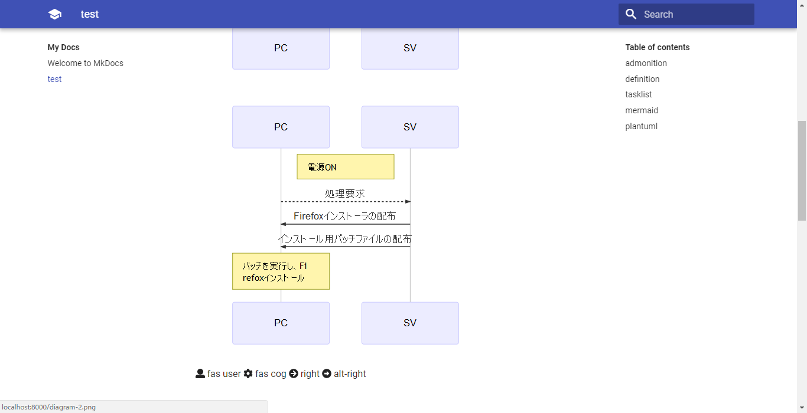

# MkDocsの書き方

MkDocsの書き方やextensionについて試した結果のメモ。
実際に試した構文や拡張機能と、その結果。

## 確認環境

```
markdown-include   0.5.1
markdown-lightbox  0.0.0
mkdocs             0.17.3
mkdocs-material    2.7.1
pymdown-extensions 4.9.1
```

* mkdocs-materialテーマでのみ確認。
* このテーマは fonts.googleapis.com からcss等を取得するため、オフライン環境だと一部おかしくなる。

## 参考

基本的な構文  
https://daringfireball.net/projects/markdown/syntax

python-markdownが標準でサポートしている拡張機能  
https://python-markdown.github.io/extensions/

pymdown-extensionsで使える拡張機能  
https://facelessuser.github.io/pymdown-extensions/

## toc

目次を付ける。

### 設定

```
markdown_extensions:
  - toc:
      permalink: true # permalinkを作成
      separator: "_"  # リンクの区切り文字を設定
      marker: "[TOC]" # 目次に置き換える文字列
      title: "=== 目次 ===" # 目次のタイトル
```

### 使用例

```
[TOC]
```

## table

表を書く。

### 設定

```
markdown_extensions:
  - tables
```

### 使用例

```
| markdown-include   | 0.5.1  |
|--------------------|--------|
| markdown-lightbox  | 0.0.0  |
| mkdocs             | 0.17.3 |
| mkdocs-material    | 2.7.1  |
| pymdown-extensions | 4.9.1  |
```

| markdown-include   | 0.5.1  |
|--------------------|--------|
| markdown-lightbox  | 0.0.0  |
| mkdocs             | 0.17.3 |
| mkdocs-material    | 2.7.1  |
| pymdown-extensions | 4.9.1  |

* 左寄せと右寄せ。
* 最初と最後の`|`は省略可能。

```
 markdown-include     | 0.5.1
:-------------------- | --------:
 markdown-lightbox    | 0.0.0
 mkdocs               | 0.17.3
 mkdocs-material      | 2.7.1
 pymdown-extensions   | 4.9.1
```

 markdown-include     | 0.5.1
:-------------------- | --------:
 markdown-lightbox    | 0.0.0
 mkdocs               | 0.17.3
 mkdocs-material      | 2.7.1
 pymdown-extensions   | 4.9.1

## abbr

略語の追加。

### 設定

```
markdown_extensions:
  - abbr
```

### 使用例

[公式](https://python-markdown.github.io/extensions/abbreviations/)から。

```
The HTML specification
is maintained by the W3C.

*[HTML]: Hyper Text Markup Language
*[W3C]:  World Wide Web Consortium
```

The HTML specification
is maintained by the W3C.

*[HTML]: Hyper Text Markup Language
*[W3C]:  World Wide Web Consortium

* 前後をスペースで区切る必要あり。
* 略語の指定はどこに書いてもよい。

## admonition

注意/警告 等の通知メッセージ。  

### 設定

```
markdown_extensions:
  - admonition
```

### 使用例

```
!!! Note
    This is Note!
```

!!! Note
    This is Note!

```
!!! Warning
    This is Warning!
```

!!! Warning
    This is Warning!

```
!!! Danger
    This is Danger!
```

!!! Danger
    This is Danger!

```
!!! Success
    This is Success!
```

!!! Success
    This is Success!

```
!!! Failure
    This is Failure!
```

!!! Failure
    This is Failure!

```
!!! Bug
    This is Bug!
```

!!! Bug
    This is Bug!

```
!!! Summary
    This is Summary!
```

!!! Summary
    This is Summary!

* タイトルを変更

```
!!! Note "Change title"
    This is Note!
```

!!! Note "Change title"
    This is Note!

## attr_list

要素に属性を付与出来る。  

### 設定

```
markdown_extensions:
  - attr_list
```

### 使用例

```
add attribute
{: #a_id .a_class }
```

add attribute
{: #a_id .a_class }

```
[_blank link](http://www.mkdocs.org/){: target="_blank" }
[_self link](http://www.mkdocs.org/){: target="_self" }
```

[_blank link](http://www.mkdocs.org/){: target="_blank" }

[_self link](http://www.mkdocs.org/){: target="_self" }

## codehilite

コードブロックを色付けする。

### 設定

```
markdown_extensions:
  - codehilite
      linenums: true # 行番号を付与
      use_pygments: true # Pygmentsを使用
```

### 使用例

```html
<i class="test">foobar</i>
```

```python
from datetime import datetime

now = datetime.now()
mm = str(now.month)
dd = str(now.day)
yyyy = str(now.year)
hour = str(now.hour)
mi = str(now.minute)
ss = str(now.second)

print mm + "/" + dd + "/" + yyyy + " " + hour + ":" + mi + ":" + ss
```

## details

admonitionを折り畳める。

### 設定

```
markdown_extensions:
  - pymdownx.details
```

### 使用例

```
???+ Note
    折り畳めるノート。展開済み。

    ??? Summary
        折り畳まれたサマリー
```

???+ note
    折り畳めるnote。

    ??? danger
        折り畳まれたdanger


## definition

定義リスト。使い道無さそう。

### 設定

```
markdown_extensions:
  - def_list
```

### 使用例

```
質問1
: 回答1
```

質問
: 回答

## footnotes

### 設定

```
markdown_extensions:
  - footnotes
```

### 使用例

```
MkDocsで脚注[^1]を付ける。

[^1]: ページの一番下に表示されるはず。
```

MkDocsで脚注[^1]を付ける。

[^1]: ページの一番下に表示されるはず。

## tasklist

GitHubっぽいタスクリスト。オプションを有効にすると外部からcssを取得する模様。

### 設定

```
markdown_extensions:
  - pymdownx.tasklist:
      custom_checkbox: true
      clickable_checkbox: true
```

### 使用例

* [x] task1
* [ ] task2

## magiclink

`http[s]://~`なテキストを、自動的にリンクにする。

### 設定

```
markdown_extensions:
  - pymdownx.magiclink
```

### 使用例

https://daringfireball.net/projects/markdown/syntax

http://www.mkdocs.org/

www.mkdocs.org

mkdocs.org

## mark

文字列をハイライト表示する。

### 設定

```
markdown_extensions:
  - pymdownx.mark
```

### 使用例

```
これは通常の文字列。  
これは==ハイライトされた文字列==
```

これは通常の文字列です。  
これは ==ハイライトされた文字列== です。

## keys

ctrlやaltをそれっぽく表示する。

### 設定

```
markdown_extensions:
  - pymdownx.keys
```

### 使用例

```
+++ctrl+alt+delete+++
```

++ctrl+alt+delete++


## mermaid

テキストで図形を描画。

### 設定

mermaid.jsとmermaid.cssを準備する。
[MkDocsPlus](https://github.com/bwmarrin/MkDocsPlus/tree/master/docs)や、
[公式](https://github.com/knsv/mermaid)から取得する。

mkdocs.ymlに以下を追加する。

```
extra_css:
  - 'css/mermaid.css'

extra_javascript:
  - 'js/mermaid.js'
```

mkdocs.ymlで指定したパスに、mermaid.jsとmermaid.cssを配置する。

### 使用例

公式の例を使用。

フローチャート

```
<div class="mermaid">
graph TD;
    A-->B;
    A-->C;
    B-->D;
    C-->D;
</div>
```

<div class="mermaid">
graph TD;
    A-->B;
    A-->C;
    B-->D;
    C-->D;
</div>

シーケンス図

```
<div class="mermaid">
sequenceDiagram
    participant Alice
    participant Bob
    Alice->John: Hello John, how are you?
    loop Healthcheck
        John->John: Fight against hypochondria
    end
    Note right of John: Rational thoughts <br/>prevail...
    John-->Alice: Great!
    John->Bob: How about you?
    Bob-->John: Jolly good!
</div>
```

<div class="mermaid">
sequenceDiagram
    participant Alice
    participant Bob
    Alice->John: Hello John, how are you?
    loop Healthcheck
        John->John: Fight against hypochondria
    end
    Note right of John: Rational thoughts <br/>prevail...
    John-->Alice: Great!
    John->Bob: How about you?
    Bob-->John: Jolly good!
</div>

ガントチャート。正直これは使わない気がする。

```
<div class="mermaid">
gantt
        dateFormat  YYYY-MM-DD
        title Adding GANTT diagram functionality to mermaid
        section A section
        Completed task            :done,    des1, 2014-01-06,2014-01-08
        Active task               :active,  des2, 2014-01-09, 3d
        Future task               :         des3, after des2, 5d
        Future task2               :         des4, after des3, 5d
        section Critical tasks
        Completed task in the critical line :crit, done, 2014-01-06,24h
        Implement parser and jison          :crit, done, after des1, 2d
        Create tests for parser             :crit, active, 3d
        Future task in critical line        :crit, 5d
        Create tests for renderer           :2d
        Add to mermaid                      :1d
</div>
```

<div class="mermaid">
gantt
        dateFormat  YYYY-MM-DD
        title Adding GANTT diagram functionality to mermaid
        section A section
        Completed task            :done,    des1, 2014-01-06,2014-01-08
        Active task               :active,  des2, 2014-01-09, 3d
        Future task               :         des3, after des2, 5d
        Future task2               :         des4, after des3, 5d
        section Critical tasks
        Completed task in the critical line :crit, done, 2014-01-06,24h
        Implement parser and jison          :crit, done, after des1, 2d
        Create tests for parser             :crit, active, 3d
        Future task in critical line        :crit, 5d
        Create tests for renderer           :2d
        Add to mermaid                      :1d
</div>

## plantuml

[plantuml-markdown](https://github.com/mikitex70/plantuml-markdown)を使う。

plantumlで画像を作成し、直接貼る。

yUMLというサービスを使う。
https://yuml.me/diagram/scruffy/class/draw

## その他

markdown_include テスト

{!include.txt!}

pymdownx.snippets テスト

--8<---
include.txt
--8<---



<i class="fas fa-user"></i> fas user
<i class="fas fa-cog"></i> fas cog
<i class="fas fa-arrow-circle-right"></i> right
<i class="fas fa-arrow-alt-circle-right"></i> alt-right

